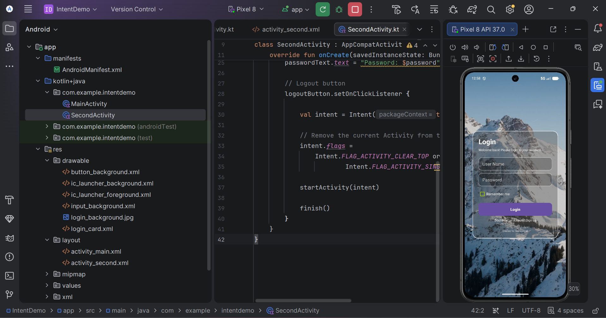
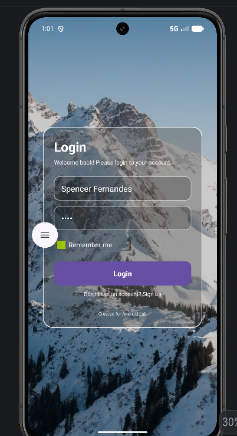
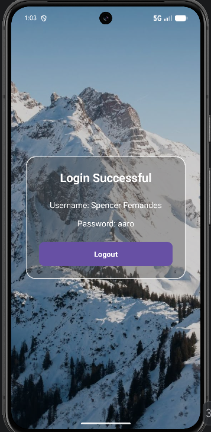

# 📱 Experiment 4: Linking Activities Using Intents

## Student Details

- **Name:** Spencer Fernandes
- **USN:** 25MCAR0123
- **Course:** Master of Computer Applications (MCA)
- **Subject:** Mobile Application Development
- **Experiment No.:** 4

---

## Aim

To develop an Android application that demonstrates linking of two Activities using Explicit Intents and passing login details from one Activity to another.

---

## Objective

- To understand the concept of Intents in Android.
- To demonstrate linking of two Activities.
- To use Explicit Intent to start another Activity.
- To pass data from one Activity to another using `putExtra()`.
- To retrieve data using `getStringExtra()`.
- To navigate back to the MainActivity using a Logout button.

---

## Software Requirements

- Android Studio
- Kotlin
- Android SDK
- Android Emulator or Android Device

---

## Description

The application consists of two Activities:

1. **MainActivity** – Contains an aesthetic login screen where the user enters a username and password.
2. **SecondActivity** – Displays the username and password received from MainActivity.

The application uses an **Explicit Intent** to link MainActivity with SecondActivity.

The entered login details are passed using Intent extras.

A **Logout** button is provided in SecondActivity to return the user to MainActivity.

---

## Application Flow

```text
        MainActivity
       ┌──────────────┐
       │    Login     │
       │              │
       │  Username    │
       │  Password    │
       │              │
       │   [ Login ]  │
       └──────┬───────┘
              │
              │ Explicit Intent
              │ + putExtra()
              ▼
       SecondActivity
       ┌──────────────┐
       │    Login     │
       │  Successful  │
       │              │
       │ Username     │
       │ Password     │
       │              │
       │  [ Logout ]  │
       └──────┬───────┘
              │
              │ Intent
              ▼
        MainActivity
```

---

## Procedure

1. Open Android Studio.
2. Create a new Android Studio project using the Empty Views Activity template.
3. Select Kotlin as the programming language.
4. Create the first Activity named `MainActivity`.
5. Create a second Activity named `SecondActivity`.
6. Design MainActivity as a login screen containing username and password fields.
7. Add a Login button to the login screen.
8. Read the username and password entered by the user.
9. Create an Explicit Intent to open `SecondActivity`.
10. Pass the username and password using `putExtra()`.
11. Retrieve the values in `SecondActivity` using `getStringExtra()`.
12. Display the received login details on the second Activity.
13. Add a Logout button to `SecondActivity`.
14. Use an Intent to return to `MainActivity` when Logout is clicked.
15. Build and run the application on an Android emulator.
16. Verify that the login details are successfully transferred between the Activities.

---

## Main Code

### MainActivity.kt

```kotlin
package com.example.intentdemo

import android.content.Intent
import android.os.Bundle
import android.widget.Button
import android.widget.EditText
import android.widget.Toast
import androidx.appcompat.app.AppCompatActivity

class MainActivity : AppCompatActivity() {

    override fun onCreate(savedInstanceState: Bundle?) {
        super.onCreate(savedInstanceState)
        setContentView(R.layout.activity_main)

        val username = findViewById<EditText>(R.id.username)
        val password = findViewById<EditText>(R.id.password)
        val loginButton = findViewById<Button>(R.id.loginButton)

        loginButton.setOnClickListener {

            val user = username.text.toString()
            val pass = password.text.toString()

            if (user.isEmpty() || pass.isEmpty()) {

                Toast.makeText(
                    this,
                    "Please enter username and password",
                    Toast.LENGTH_SHORT
                ).show()

            } else {

                val intent = Intent(this, SecondActivity::class.java)

                intent.putExtra("username", user)
                intent.putExtra("password", pass)

                startActivity(intent)
            }
        }
    }
}
```

---

### SecondActivity.kt

```kotlin
package com.example.intentdemo

import android.content.Intent
import android.os.Bundle
import android.widget.Button
import android.widget.TextView
import androidx.appcompat.app.AppCompatActivity

class SecondActivity : AppCompatActivity() {

    override fun onCreate(savedInstanceState: Bundle?) {
        super.onCreate(savedInstanceState)
        setContentView(R.layout.activity_second)

        val username = intent.getStringExtra("username")
        val password = intent.getStringExtra("password")

        val usernameText = findViewById<TextView>(R.id.usernameText)
        val passwordText = findViewById<TextView>(R.id.passwordText)
        val logoutButton = findViewById<Button>(R.id.logoutButton)

        usernameText.text = "Username: $username"
        passwordText.text = "Password: $password"

        logoutButton.setOnClickListener {

            val intent = Intent(this, MainActivity::class.java)

            intent.flags =
                Intent.FLAG_ACTIVITY_CLEAR_TOP or
                Intent.FLAG_ACTIVITY_SINGLE_TOP

            startActivity(intent)

            finish()
        }
    }
}
```

---

## Important Intent Methods Used

### Explicit Intent

```kotlin
val intent = Intent(this, SecondActivity::class.java)
```

An Explicit Intent specifies the exact Activity that should be opened.

### Passing Data

```kotlin
intent.putExtra("username", user)
intent.putExtra("password", pass)
```

`putExtra()` is used to attach data to the Intent.

### Receiving Data

```kotlin
val username = intent.getStringExtra("username")
val password = intent.getStringExtra("password")
```

`getStringExtra()` retrieves the String data passed through the Intent.

### Starting an Activity

```kotlin
startActivity(intent)
```

This starts the Activity specified by the Intent.

### Returning to MainActivity

```kotlin
Intent(this, MainActivity::class.java)
```

The Logout button creates an Intent to return to MainActivity.

---

## AndroidManifest.xml

Both Activities are declared in the Android Manifest.

```xml
<activity
    android:name=".SecondActivity"
    android:exported="false" />

<activity
    android:name=".MainActivity"
    android:exported="true">

    <intent-filter>
        <action android:name="android.intent.action.MAIN" />
        <category android:name="android.intent.category.LAUNCHER" />
    </intent-filter>

</activity>
```

---

## User Interface

The application contains an aesthetic login interface with:

- Landscape background image
- Transparent glass-style login card
- Username input field
- Password input field
- Remember Me checkbox
- Login button
- Login confirmation screen
- Logout button

---

## Output

### Test Case 1 – Login Screen

The first Activity displays the login screen. The user enters the username and password and clicks the Login button.



---

### Test Case 2 – Login Successful

After clicking Login, the application opens the second Activity and displays the username and password received from MainActivity.



---

### Test Case 3 – Logout

The Logout button returns the user to the MainActivity login screen.



---

## Result

The Android application was successfully developed and executed. The application demonstrated linking of two Activities using an Explicit Intent. The username and password entered in MainActivity were successfully passed to SecondActivity and displayed. The Logout button successfully returned the user to MainActivity.

---

## Conclusion

The experiment was successfully completed. It demonstrated how Intents are used to link Activities in Android applications and how data can be transferred between Activities using `putExtra()` and `getStringExtra()`. The experiment also demonstrated navigation between Activities using Login and Logout operations.